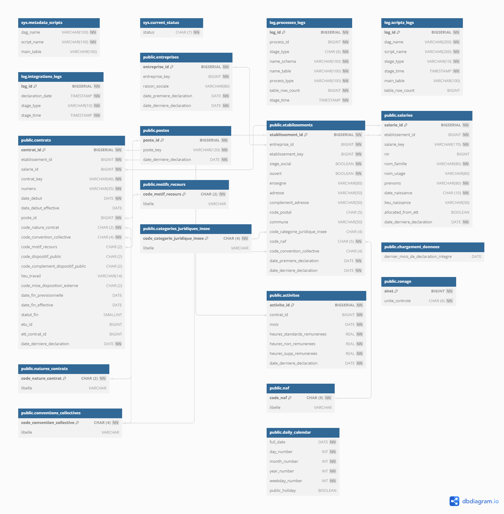

# Catalogue des données de la base Champollion

La base Champollion se source sur les données des déclarations sociales nominatives (DSN). C'est une base construite pour être facilement exploitée à des fins opérationnelles par les directions métier. Pour ce faire, les données DSN sont re-structurées, chaînées dans le temps et consolidées. Il n'y a pas d'historisation des changements, les données disponibles sont les dernières informations  sans considération des valeurs antérieures. Le périmètre de la base Champollion est voué à s'étendre avec l'ajout de nouveaux cas d'usage. A date, elle n'est utilisée que pour l'application VisuDSN à destination de l'Inspection du Travail.

Ce catalogue comporte de nombreuses références au [cahier technique de la norme Neodes](https://www.net-entreprises.fr/media/documentation/dsn-cahier-technique-2023.1.pdf).

## Données répertoriées par table

### Table `chargement_donnees`

| Colonne | Type | NULL possible | Explication | Remarque | Rubrique DSN |
|---|---|---|---|---|---|
| dernier_mois_de_declaration_integre | DATE | Oui | Dernier mois de déclaration DSN intégré en base |  |  |

### Table `entreprises`

| Colonne | Type | NULL possible | Explication | Remarque | Rubrique DSN |
|---|---|---|---|---|---|
| entreprise_id | BIGSERIAL | Non | Id de l'entreprise dans la base |  |  |
| entreprise_key | BIGINT | Non | SIREN de l'entreprise | Attention, le SIREN étant stocké avec un type numéraire, s'il contient des 0 au début, ils seront supprimés. Ainsi, pour reconstituer un siren exact il faut ajouter autant de 0 que nécessaires au début pour obtenir un numéro à 9 chiffres. | S21.G00.06.001 |
| raison_sociale | VARCHAR(80) | Oui | Raison sociale de l'entreprise |  |  |
| date_premiere_declaration | DATE | Non | Date de la première déclaration pour cette entreprise |  |  |
| date_derniere_declaration | DATE | Non | Date de la dernière déclaration pour cette entreprise |  |  |

### Table `etablissements`

| Colonne | Type | NULL possible | Explication | Remarque | Rubrique DSN |
|---|---|---|---|---|---|
| etablissement_id | BIGSERIAL | Non | Id de l'établissement dans la base Champollion |  |  |
| entreprise_id | BIGINT | Non | Id de l'entreprise à laquelle appartient l'établissement |  |  |
| etablissement_key | BIGINT | Non | SIRET de l'établissement | Attention, le SIRET étant stocké avec un type numéraire, s'il contient des 0 au début, ils seront supprimés. Ainsi, pour reconstituer un SIRET exact il faut ajouter autant de 0 que nécessaires au début pour obtenir un numéro à 14 chiffres. | S21.G00.06.001 + S21.G00.11.001 |
| siege_social | BOOLEAN | Non | 0 si l'établissement n'est pas le siège social de l'entreprise, 1 sinon |  |  |
| enseigne | VARCHAR(80) | Oui | Enseigne de l'établissement |  |  |
| adresse | VARCHAR(50) | Oui | Adresse de l'établissement |  | S21.G00.11.003 |
| complement_adresse | VARCHAR(50) | Oui | Complément de l'adresse de l'établissement |  | S21.G00.11.006 |
| code_postal | CHAR(5) | Oui | Code postal de l'établissement |  | S21.G00.11.004 |
| commune | VARCHAR(50) | Oui | Commune de l'établissement |  | S21.G00.11.005 |
| code_categorie_juridique_insee | CHAR(4) | Oui | Code de la catégorie juridique (typologie INSEE) de l'établissement |  | S21.G00.11.112 |
| code_naf | CHAR(5) | Oui | Code NAF de l'établissement |  | S21.G00.11.002 |
| code_convention_collective | CHAR(4) | Oui | Code de la convention collective de l'établissement |  | S21.G00.11.022 |
| date_premiere_declaration | DATE | Non | Date de la première déclaration pour cet établissement |  |  |
| date_derniere_declaration | DATE | Non | Date de la dernière déclaration pour cet établissement |  |  |

### Table `salaries`

| Colonne | Type | NULL possible | Explication | Remarque | Rubrique DSN |
|---|---|---|---|---|---|
| salarie_id | BIGSERIAL | Non | Id du salarié dans la base Champollion |  |  |
| etablissement_id | BIGINT | Non | Id de l'établissement employant le salarié |  |  |
| salarie_key | VARCHAR(170) | Non | NIR du salarié si renseigné, concaténation du nom de famille, prénoms et date de naissance sinon |  |  |
| nir | BIGINT | Oui | NIR du salarié | Il s'agit en réalité d'un NIR randomisé en base, seul le premier chiffre indiquant le sexe est celui du NIR d'origine. Si la valeur du NIR est nulle, les champs nom_famille, prenoms, date_naissance ne peuvent pas être nuls. | S21.G00.30.001 |
| nom_famille | VARCHAR(80) | Oui | Nom de famille du salarié |  | S21.G00.30.002 |
| nom_usage | VARCHAR(80) | Oui | Nom d'usage du salarié |  | S21.G00.30.003 |
| prenoms | VARCHAR(80) | Oui | Prénoms du salarié |  | S21.G00.30.004 |
| date_naissance | VARCHAR(10) | Oui | Date de naissance du salarié | La date de naissance au format AAAA-MM-JJ peut comporter des suites de 9 pour les parties inconnues de la date. | S21.G00.30.006 |
| lieu_naissance | VARCHAR(30) | Oui | Lieu de naissance du salarié |  | S21.G00.30.007 |
| allocated_from_ett | BOOLEAN | Oui | 1 si le salarié est un intérimaire qui a été déclaré par un ou plusieurs établissements de travail temporaire (ETT) comme travaillant dans cet établissement utilisateur (ETU), 0 ou NULL sinon |  |  |
| date_derniere_declaration | DATE | Non | Date de la dernière déclaration pour ce salarié |  |  |

### Table `contrats`

| Colonne | Type | NULL possible | Explication | Remarque | Rubrique DSN |
|---|---|---|---|---|---|
| contrat_id | BIGSERIAL | Non | Id du contrat dans la base Champollion |  |  |
| etablissement_id | BIGINT | Non | Id de l'établissement qui détient le contrat |  |  |
| salarie_id | BIGINT | Non | Id du salarié qui est employé par ce contrat |  |  |
| contrat_key | VARCHAR(46) | Non | Concaténation du numéro du contrat, d'un symbole '_' et de la date de début du contrat |  |  |
| numero | VARCHAR(35) | Non | Numéro du contrat de travail |  | S21.G00.40.009 |
| date_debut | DATE | Non | Date de début du contrat de travail | Si une date de début effective, différente de la date de début, est renseignée, alors la date de début à considérer est la date de début effective. | S21.G00.40.001 |
| date_debut_effective | DATE | Oui | Date de début effective du contrat | La valeur de la date de début effective est nulle pour la plupart des cas, elle peut être renseignée avec une date différente de la date de début en cas de transfert d'employeur, elle est alors égale à la date du transfert. |  |
| poste_id | BIGINT | Oui | Id du libellé de poste |  | sur la base de S21.G00.40.006 |
| code_nature_contrat | CHAR(2) | Oui | Code de la nature du contrat de travail |  | S21.G00.40.007 |
| code_convention_collective | CHAR(4) | Oui | Code de la convention collective du contrat de travail |  | S21.G00.40.017 |
| code_motif_recours | CHAR(2) | Oui | Code du motif de recours |  | S21.G00.40.021 |
| code_dispositif_public | CHAR(2) | Oui | Code du dispositif de politique publique d'emploi ou de formation professionnelle |  | S21.G00.40.008 |
| code_complement_dispositif_public | CHAR(2) | Oui | Code du complément de dispositif public pour les salariés concernés par une aide au poste en entreprise adaptée ou structure d'insertion par l'activité économique |  | S21.G00.40.073 |
| lieu_travail | VARCHAR(14) | Oui | Identifiant du lieu de travail effectif du salarié (SIRET si applicable, sinon codification libre) |  | S21.G00.40.019 |
| code_mise_disposition_externe | CHAR(2) | Oui | Nature de la mise à disposition externe du salarié |  | S21.G00.40.074 |
| date_fin_previsionnelle | DATE | Oui | Date de fin prévisionnelle du contrat de travail déclarée par l'établissement | La date de fin prévisionnelle ne fait l'objet d'aucune vérification et doit être manipulée avec prudence. La date de fin effective est dans tous les cas à privilégier. | S21.G00.40.010 |
| date_fin_effective | DATE | Oui | Date de fin effective du contrat déclarée ou déduite | Si la date de fin effective est strictement antérieure à la date de début du contrat, cela signifie que le contrat a été annulé. La norme DSN interdit ce cas de figure mais cela est possible en base Champollion dans deux cas précis : un changement d'employeur antérieur à la date de début du contrat (le contrat chez l'ancien employeur est donc "annulé") ou une absence de déclaration (fin de contrat en statut 1) de ce contrat antérieure au premier mois de validité du contrat. | sur la base de S21.G00.62.001 |
| statut_fin | SMALLINT | Oui | 2 si la date de fin effective a été ajoutée suite à la déclaration spécifique de l'établissement ou à un changement d'employeur, 1 si la date de fin effective a été déduite en base, 0 ou NULL si la valeur de la date de fin effective est nulle. |  |  |
| etu_id | BIGINT | Oui | Id de l'établissement utilisateur pour les contrats d'intérim des établissements de travail temporaires |  | sur la base de S21.G00.40.046 |
| ett_contrat_id | BIGINT | Oui | Dans le cas d'un contrat re-distribué depuis un établissement de travail temporaire (ETT) vers un établissement utilisateur (ETU), id du contrat d'intérim dans l'ETT |  |  |
| date_derniere_declaration | DATE | Non | Date de la dernière déclaration pour ce contrat |  |  |

### Table `postes`

| Colonne | Type | NULL possible | Explication | Remarque | Rubrique DSN |
|---|---|---|---|---|---|
| poste_id | BIGSERIAL | Non | Id du poste dans la base Champollion |  |  |
| poste_key | VARCHAR(120) | Non | Libellé du poste de travail |  | S21.G00.40.006 |
| date_derniere_declaration | DATE | Non | Date de la dernière déclaration mentionnant un contrat ayant ce libellé de poste |  |  |

### Table `activites`

| Colonne | Type | NULL possible | Explication | Remarque | Rubrique DSN |
|---|---|---|---|---|---|
| activite_id | BIGSERIAL | Non | Id de l'activité (volume horaire mensuel) |  |  |
| contrat_id | BIGINT | Non | Id du contrat concerné par l'activité renseignée | Pour les contrats d'intérim redistribués depuis les entreprises d'intérim vers les entreprises utilisatrices, ce champ correspond à `contrats.ett_contrat_id` et non pas `contrats.contrat_id`. |  |
| mois | DATE | Non | Mois considéré |  | sur la base de S21.G00.51.001 et S21.G00.51.002  |
| heures_standards_remunerees | REAL | Non | Somme des heures standards rémunérées | Montant pouvant être négatif dans de très rares cas. | sur la base de S21.G00.53.002 |
| heures_non_remunerees | REAL | Non | Somme des heures non rémunérées | Montant pouvant être négatif dans de très rares cas. | sur la base de S21.G00.53.002 |
| heures_supp_remunerees | REAL | Non | Somme des heures supplémentaires rémunérées | Montant pouvant être négatif dans de très rares cas. | sur la base de S21.G00.51.012 |
| date_derniere_declaration | DATE | Non | Date de la dernière déclaration ayant fait état d'heures travaillées pour ce contrat sur ce mois |  |  |

### Table `categories_juridiques_insee`

| Colonne | Type | NULL possible | Explication | Remarque | Rubrique DSN |
|---|---|---|---|---|---|
| code_categorie_juridique_insee | CHAR(4) | Non | Code de la catégorie juridique dans la nomenclature de l'INSEE |  | S21.G00.11.112 |
| libelle | VARCHAR | Non | Libellé correspondant |  |  |

### Table `motifs_recours`

| Colonne | Type | NULL possible | Explication | Remarque | Rubrique DSN |
|---|---|---|---|---|---|
| code_motif_recours | CHAR(2) | Non | Code du motif de recours |  | S21.G00.40.021 |
| libelle | VARCHAR | Non | Libellé correspondant |  |  |

### Table `naf`

| Colonne | Type | NULL possible | Explication | Remarque | Rubrique DSN |
|---|---|---|---|---|---|
| code_naf | CHAR(5) | Non | Code du NAF |  | S21.G00.11.002 |
| libelle | VARCHAR | Non | Libellé correspondant |  |  |

### Table `conventions_collectives`

| Colonne | Type | NULL possible | Explication | Remarque | Rubrique DSN |
|---|---|---|---|---|---|
| code_convention_collective | CHAR(4) | Non | Code de la convention collective |  | S21.G00.11.022 et S21.G00.40.017 |
| libelle | VARCHAR | Non | Libellé correspondant |  |  |

### Table `natures_contrats`

| Colonne | Type | NULL possible | Explication | Remarque | Rubrique DSN |
|---|---|---|---|---|---|
| code_nature_contrat | CHAR(2) | Non | Code de la nature du contrat de travail |  | S21.G00.40.007 |
| libelle | VARCHAR | Non | Libellé correspondant |  |  |

### Table `zonage`

| Colonne | Type | NULL possible | Explication | Remarque | Rubrique DSN |
|---|---|---|---|---|---|
| siret | BIGINT | Non | SIRET de l'établissement |  |  |
| unite_controle | CHAR(6) | Non | Code de l'unité de contrôle en charge de cet établissement |  |  |

### Table `daily_calendar`

| Colonne | Type | NULL possible | Explication | Remarque | Rubrique DSN |
|---|---|---|---|---|---|
| full_date | DATE | Non | Date au format AAAA-MM-DD |  |  |
| day_number | INT | Non | Jour au format DD |  |  |
| month_number | INT | Non | Mois au format MM |  |  |
| year_number | INT | Non | Année au format AAAA |  |  |
| weekday_number | INT | Non | Jour de la semaine de 0 à 6 (0 pour dimanche et 6 pour samedi) |  |  |
| public_holiday | BOOLEAN | Oui | Si égal 1, cette date est un jour férié |  |  |

## Schéma de la base de données

