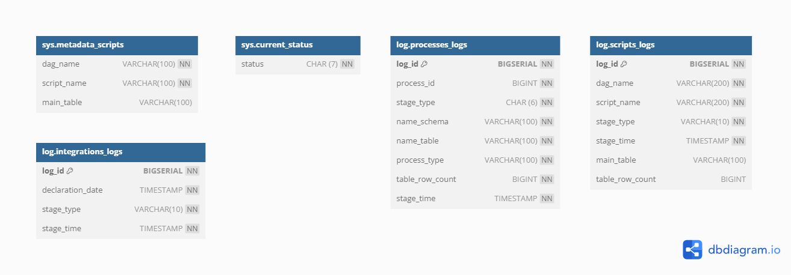
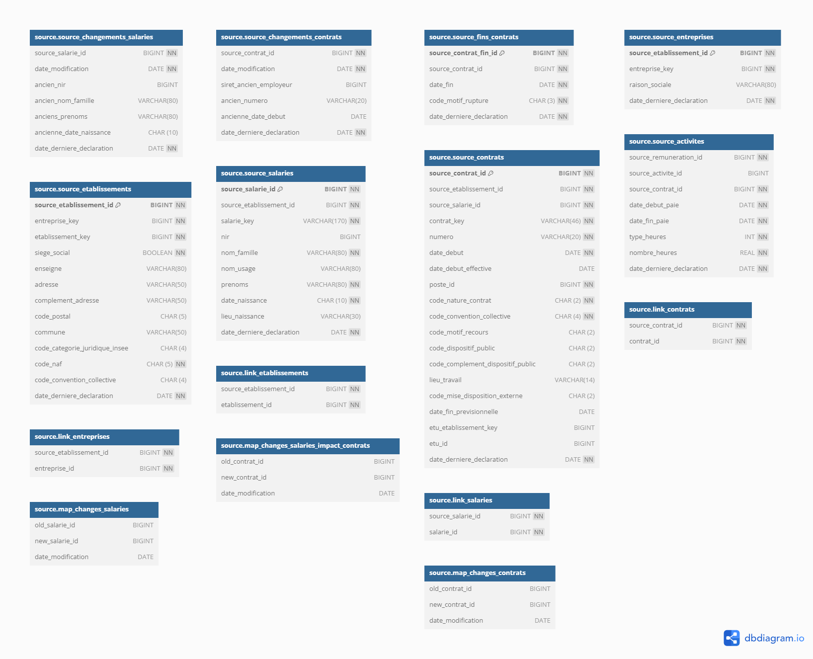
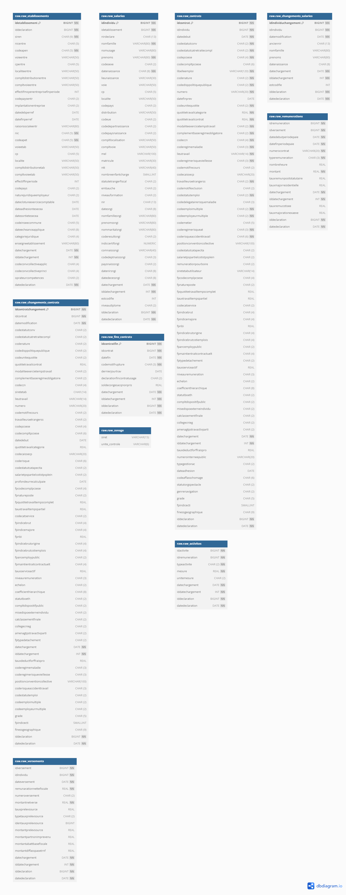
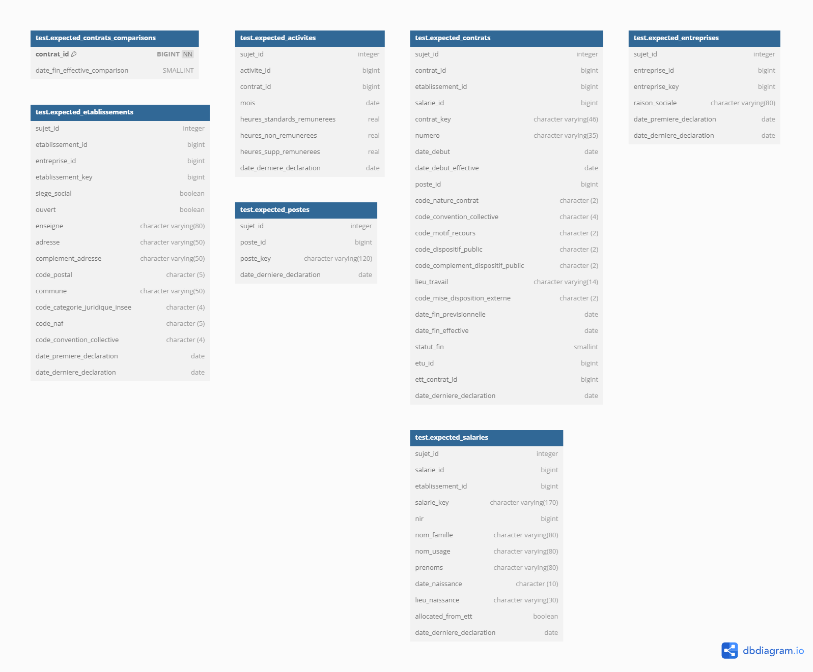
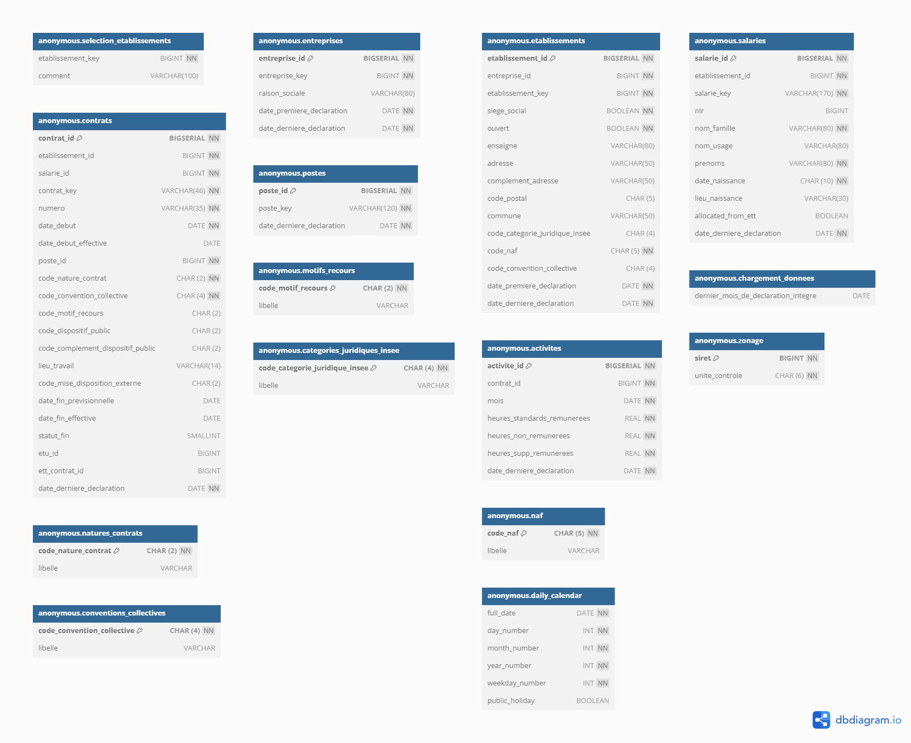

# Diagrammes des différents schémas au sein des bases de données

*Les diagrammes ont été générés avec l'outil [dbdiagram](https://dbdiagram.io/).*

## Schéma `public`

Pour plus d'informations : TO DO 

## Schémas `sys` et `log`

Pour plus d'informations : TO DO 

## Schéma `source`

Pour plus d'informations : TO DO 

## Schéma `raw`

Pour plus d'informations : TO DO 

## Schéma `test`

Pour plus d'informations : TO DO 

## Schéma `anonymous`

Pour plus d'informations : TO DO 