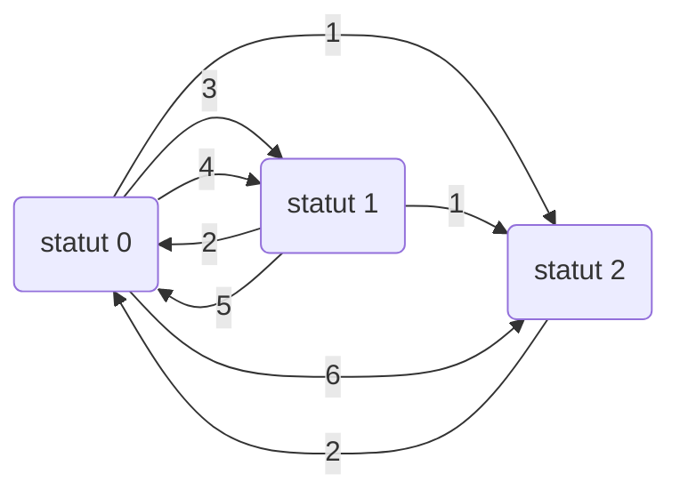

# Contenu des scripts d'intégration

## Tuples identifiants 

L'intégration de données mensuelles dans une base apériodique (c.a.d qui ne fait pas état de découpage temporel des *objets*) nécessite de mapper les données mensuelles vers des lignes nouvelles ou existantes.

<ins>Définition</ins> : On appelle **objet** tout élément qui est déclaré mensuellement ou infra-mensuellement mais a une existence apériodique.

Ainsi, les entreprises, les établissements, les salariés, les contrats, etc. sont des objets.

<ins>Définition</ins> : On appelle **tuple identifiant** une combinaison de colonnes qui permet à tout objet d'être identifié de manière unique.

Ainsi, **la définition des tuples identifiants pour chaque objet de la base est critique**. En base, on utilise les tuples identifiants suivants :

| Objet         | Tuple identifiant                                                              |
|---------------|----------------------------------------------------------------------------------------|
| Entreprise    | SIREN                                                                                  |
| Etablissement | SIREN + NIC = SIRET                                                                            |
| Salarié       | SIRET, NIR ou (à défaut, nom + prénoms + date de naissance)                                      |
| Contrat       | SIRET, NIR ou (à défaut, nom + prénoms + date de naissance), (numéro du contrat + date de début) |
| Activité         | SIRET, NIR ou (à défaut, nom + prénoms + date de naissance), (numéro du contrat + date de début), mois                                                                                |

On remarque que les tuples identifiants ci-dessus mettent en lumière les liens de dépendance des objets de la base. En effet : 

- un établissement n'existe qu'au sein d'une entreprise
- un salarié n'existe qu'au sein d'un établissement
- un contrat n'est valable que pour un salarié
- une activité (volume horaire) n'est valable que pour un contrat

On dit qu'un objet est parent d'un autre lorsque le second n'est défini qu'à travers son appartenance au premier. Les liens hiérarchiques au sein de la base sont les suivants :

| Parent        | Enfant        |
|---------------|---------------|
| entreprise    | établissement |
| établissement | salarié       |
| salarié       | contrat       |
| contrat       | activité      |

<ins>Définition</ins> : Au sein d'un **tuple identifiant**, on distingue la **clef identifiante**, qui correspond aux informations relatives à l'objet considéré directement, et les **identifiants généalogiques** qui concernent les entités parentes de l'objet. On note `ti` les tuples identifiants et `ci` les clefs identifiantes.

<ins>Propriéte</ins> : Soit un objet `O` et son parent `P`. On a `ti(O) = (ti(P), ci(O))`.

Dans la base, la clef identifiante correspond dans chaque table au champ `<nom objet>_key` à une exception près. On a : 
- `entreprise_key` dans la table `entreprises` : SIREN
- `etablissement_key` dans la table `etablissements` : SIRET
- `salarie_key` dans la table `salaries` : NIR ou, si le NIR n'est pas renseigné, (nom + prénoms + date de naissance)
- `contrat_key` dans la table `contrats` : (numéro du contrat + date de début)
- `mois` dans la table `activites` : mois de l'activité

A noter que le champ `etablissement_key` ne pourrait être que le NIC. Néanmoins, pour des questions d'optimisation de requête, nous avons opté pour le SIRET même si la partie "SIREN" du siret est une information redondante avec l'identifiant généalogique, c'est-à-dire la clef identifiante de l'entreprise.

De plus, à chaque objet, donc à chaque tuple identifiant, correspond un `id`. Dès lors, on définit le **tuple identifiant fonctionnel** tel que `ti(O) = id(P) + ci(O)` avec `id(P)`, l'id du parent.

| Objet         | Tuple identifiant fonctionnel en base |
|---------------|---------------------------------------------------|
| Entreprise    | `entreprise_key`                                    |
| Etablissement | `entreprise_id`, `etablissement_key`                  |
| Salarié       | `etablissement_id`, `salarie_key`                     |
| Contrat       | `etablissement_id`, `salarie_id`, `contrat_key`         |
| Activité       | `contrat_id`, `mois`       |

On remarque que le tuple identifiant fonctionnel d'un contrat comporte une information redondante. En effet, le champ `etablissement_id` n'est pas nécessaire puisque l'information sous-jacente est déjà présente dans `salarie_id`. Néanmoins, il est plus pratique de l'inclure afin d'avoir le lien direct entre les tables `contrats` et `etablissements` plutôt que de devoir systématiquement passer par la table `salaries`.

## Scripts *create*

Les scripts *create* sont au nombre de 4, ils permettent l'initialisation de la structure de la base.

### `create_permanent_tables`

Dans `create_permanent_tables`, on créé les 5 schémas de la base (`public`, `log`, `raw`, `source`, `sys`) et les tables permanentes dans `public`, `sys` et `log`. 

Les types des colonnes sont spécifiés grâce à la [norme Neodes du cahier technique de la DSN](https://www.net-entreprises.fr/media/documentation/dsn-cahier-technique-2023.1.pdf). En ce qui concerne la nomenclature des colonnes, se référer à la documentation de la base. 

Dans chaque table des contraintes `uk_...` servent à assurer l'unicité du tuple identifiant fonctionnel. Les contraintes `vk_...` quant à elle s'assurent de la cohérence du champ `..._key`. De plus, des contraintes `FOREIGN KEY` sont déclarées afin d'assurer la cohérence des données, la suppression d'une contrainte `FOREIGN KEY` est fortement déconseillée et doit faire l'objet d'une étude attentive.

Les contraintes d'unicité sur les tuples identifiants fonctionnels impliquent la création d'un index par défaut sur ce tuple de colonnes, voir la [documentation Postgres](https://www.postgresql.org/docs/current/indexes-unique.html#:~:text=PostgreSQL%20automatically%20creates%20a%20unique,mechanism%20that%20enforces%20the%20constraint.). Si d'autres index doivent être créés pour accélérer les traitements, ils le sont dans ce script. Pour le moment, seul un index sur la colonne `salarie_id` de la table `contrats` a été nécessaire.

### `create_integration_tables`

Le script `create_integration_tables` créé les tables d'intégration des schémas `raw` et `source`. Les types des colonnes sont également spécifiés grâce à la [norme Neodes du cahier technique de la DSN](https://www.net-entreprises.fr/media/documentation/dsn-cahier-technique-2023.1.pdf).

### `create_trigger_logs`

La base possède trois niveaux de log (au niveau de l'intégration, du script et de l'opération). Pour plus d'informations, voir la documentation sur la base (TO DO). Dans le script `create_trigger_logs`, on définit les procédures et fonctions qui vont permettent l'écriture des logs aux niveaux scripts et opérations :

- la procédure `log.log_script` permet, lorsqu'elle est appelée, d'inscrire, dans la table `log.scripts_logs`, l'heure et le nombre de ligne. Cette procédure doit être appelée au début et à la fin de chaque script.
- la *trigger function* `log_process` permet d'inscrire dans la table `log.processes_logs` le type d'action, l'heure et le nombre de ligne lorsqu'elle est appelée. On la rend valide sur toutes les tables des schémas `public`, `raw` et `source` de telle sorte que dès qu'une action de type `INSERT`, `DELETE`, `UPDATE` et `TRUNCATE` est effectuée sur une table de ces trois schémas, le log soit automatique.

De plus, les scripts `integration_log_begin` et `integration_log_end` qui sont appelés au début et à la fin de chaque intégration permettent le logging dans la table `log.integrations_logs`.

### `create_dag_status_functions`

La fonction `set_status_to_ongoing` créée par le script `create_dag_status_functions` sert à mettre le statut de la base (champ `sys.current_status.status`) à la valeur `ONGOING` au démarrage d'une intégration. Si le statut est déjà à la valeur `ONGOING`, une erreur est levée.

La fonction `set_status_to_success` quant à elle sert à mettre le statut de la base à la valeur `SUCCESS` à la fin d'une intégration réussie.

Ce script est notamment utile pour l'utilisation de airflow, voir la documentation sur la pipeline.

## Script d'insertion des données statiques

Les tables dites *statiques* (voir documentation de la base pour plus de détails) sont des tables de données de contexte qui ne font pas l'objet d'intégrations mensuelles. Lorsque les fichiers source sur lesquels les scripts `update` se basent changent (ex : mise à jour des NAF en France), les scripts :

- `update_calendar`
- `update_categories_juridiques_insee`
- `update_conventions_collectives`
- `update_holidays`
- `update_motifs_recours`
- `update_naf`
- `update_natures_contrats`

complètent les données existantes.

Les scripts `extract_and_load_metadata` et `update_zonage`, quant à eux, écrasent les données existantes avec la dernière version de leur fichier csv.

## Scripts *extract*

Les scripts *extract* permettent l'extraction des données brutes dans les tables *raw* (se référer au fichier [1_integration_scripts_structure.md](./1_integration_scripts_structure.md)). Ils sont tous construits grâce à la fonction `get_copy_query` de `core/sql/utils.py`. La plupart des scripts *extract* ont donc la forme suivante :

```sql
TRUNCATE TABLE table_name CASCADE;
COPY table_name
FROM file_name
WITH (
  FORMAT 'csv', -- ce sont des fichiers csv
  HEADER, -- la première ligne contient le nom des colonnes
  FREEZE, -- améliore la performance mais nécessite que la table ait été créée ou tronquée précédemment
  DELIMITER ';', -- séparateur entre les colonnes
  QUOTE '|', -- symbole encadrant une donnée textuelle
  ENCODING 'WIN1252' -- encodage windows
);
```

On utilise la fonction Postgres `COPY`, cela implique que les données ne transitent pas par un outil tierce (par exemple un orchestrateur python), le fichier csv est directement lu et *ingéré* par la base de données. En particulier, cela nécessite que l'utilisateur base de données, autrement dit l'*user* (`postgres` par exemple), ait les droits en lecture sur les fichiers csv concernés. La bonne pratique consiste à ajouter l'*user* dans le groupe UNIX detenant les fichiers csv. Pour plus d'informations sur la fonction `COPY` de Postgres se référer à la [documentation Postgres](https://docs.postgresql.fr/16/sql-copy.html).

Pour avoir plus d'informations sur les fichiers bruts de la DSN, voir [0_raw_DSN.md](./0_raw_DSN.md).

## Scripts *transform*

Les scripts *transform* permettent de sélectionner les colonnes nécessaires, de croiser les données des différentes tables *raw*, de convertir et de transformer certaines colonnes. Ils permettent le peuplement des tables *source* (se référer au fichier [1_integration_scripts_structure.md](./1_integration_scripts_structure.md)). Au-delà de la sélection de colonnes, nous listons ci-dessous les spécificités de chaque script :

| Script 	| Traitement spécifique 	|
|---	|---	|
| `transform_entreprises` 	| * Conversion du SIREN en entier. 	|
| `transform_etablissements` 	| * Conversion du SIREN et du SIRET en entier.  A noter qu'une fois transformés en entier, les SIREN et SIRET peuvent *perdre* les zéros frontaux (par exemple la string "001234567" devient l'entier 1234567), c'est pourquoi il faut veiller à toujours convertir dans un sens (`CAST ... AS BIGINT`) ou dans l'autre (`TO_CHAR(..., 'fm000000000')` avec `'fm000000000'` correspondant à la taille de la string souhaitée) lorsqu'on compare deux valeurs de types différents. <br>* Inférence du statut de siège social : `COALESCE(nicentre = nic, FALSE)` &rarr; si le NIC du siège social est renseigné et que le NIC de l'établissement est égal au NIC du siège social, alors il s'agit du siège social. 	|
| `transform_salaries`  	| * Conversion en lettres majuscules (`UPPER`) sans *trailing whitespaces* (`TRIM`) des noms de famille, noms d'usage et prénoms. <br>* Conversion au format `DD-MM-YYYY` de la date de naissance. A noter que l'on utilise pas une fonction de conversion en format date car la date de naissance peut comporter des suites de 9 pour les informations inconnues par l'employeur. Par exemple, si un employeur sait qu'un salarié est né en 1990 mais ne connaît ni le jour ni le mois de naissance de celui-ci, il remplira comme date de naissance 99-99-1990. <br>* Création du champ `salarie_key` qui correspond à `(NIR \| NOM_FAMILLE+PRENOMS+DATE_NAISSANCE)` (exemple : pour un individu sans NIR s'appelant Yolande DURAND née le 16-07-1967, son identifiant `salarie_key` sera `DURANDYolande16-07-1967`). 	|
| `transform_contrats`  	| * Jointure avec la table `source.source_salaries` pour récupérer l'id de l'établissement (id dans la base de données brute). <br>* Conversion du numéro de contrat en lettres majuscules sans *trailing whitespaces*. <br>* Jointure avec la table `public.postes` (qui a été complétée avant l'exécution de ce script) afin de récupérer l'id du libellé de poste du contrat dans la base. <br>* Sous conditions que le string soit de taille 14 et qu'il ne contienne que des chiffres, conversion en entier du siret de l'établissement utilisateur pour les contrats d'intérim puis jointure avec la table `public.etablissements` pour retrouver l'id correspondant à cet établissement utilisateur. A noter que cette étape nécessite que le script `load_etablissements` soit bien exécuté avant celui-ci. <br>* Création du champ `contrat_key` qui correspond à la concaténation suivante `(NUMERO_CONTRAT + '_' + DATE_DEBUT_CONTRAT)`.|
| `transform_changements_salaries`  	| * Concaténation des changements fragmentés (voir ci-dessous pour plus d'explications). <br>* Conversion de l'ancien nom de famille et des anciens prénoms en lettres majuscules sans *trailing whitespaces*. <br>* Conversion au format `DD-MM-YYYY` de l'ancienne date de naissance. <br>* Sélection des seules lignes qui comportent des changements relatifs à la clef identifiante. |
| `transform_changements_contrats` 	| * Concaténation des changements fragmentés (voir ci-dessous pour plus d'explications). <br>* Conversion du siret de l'ancien employeur en entier. <br>* Conversion de l'ancien numéro de contrat en lettres majuscules sans *trailing whitespaces*. <br>* Sélection des seules lignes qui comportent des changements relatifs à la clef identifiante. |
| `transform_fins_contrats`  	| *Aucun traitement spécifique.* |
| `transform_activites`  	| * Sélection des lignes correspondant à un type de rémunération `002` (Salaire brut soumis à contributions d'Assurance chômage), `017` (Heures supplémentaires ou complémentaires aléatoires) ou `018` (Heures supplémentaires structurelle) et création d'un champ `type_heures` pour distinguer les heures rémunérées des heures non rémunérées et des heures supplémentaires. <br>* Jointures avec les tables `raw.raw_remunerations`, `raw.raw_versements`, `raw.raw_contrats` pour récupérer l'id du contrat concerné par les heures déclarées. <br>* Conversion du volume horaire en heures selon l'unité de mesure déclarée. |

A noter qu'il n'existe pas de script `transform_postes` par souci de simplicité. La seule opération à effectuer étant la récupération du libellé d'emploi en majuscules et sans *trailing whitespaces* dans la table `raw_contrats`, cette dernière est effectuée dans le script `load_postes`.

### Concaténation des changements fragmentés

La déclaration de changements simultanés de données identifiantes doit faire l'objet d'un seul et même bloc changement (cf cahier technique de la DSN). Malheureusement, tous les établissements ne respectent pas cette norme. Ainsi, si un établissement déclare au mois M, une salariée, Mme Yolande DURAND née le 16/07/1967, telle que : 

| Id Salarié 	| Nom 	| Prénoms 	| Date de naissance 	|
|---	|---	|---	|---	|
| 1 	| DURAND 	| Yolande 	|  16-07-1967	|

pour déclarer que cette dernière s'appelait en réalité Brigitte THOMAS jusqu'au 1er janvier 2021, l'établissement doit envoyer un bloc changement de la forme suivante :

| Id Salarié Changement 	| Id Salarié 	| Ancien Nom 	| Anciens prénoms 	| Ancienne date de naissance 	| Date de modification |
|---	|---	|---	|---	|---	|---
| 1 	| 1 	| THOMAS	| Brigitte  	| 	| 01-01-2021 |

Mais certaines entreprises vont, à tord, déclarer ces deux changements identifiants de manière fragmentée tels que : 

| Id Salarié Changement 	| Id Salarié 	| Ancien Nom 	| Anciens prénoms 	| Ancienne date de naissance 	| Date de modification |
|---	|---	|---	|---	|---	|---
| 1 	| 1 	| 	| Brigitte  	|  | 01-01-2021 |
| 2 	| 1 	| THOMAS	|   	| 	| 01-01-2021 |

Dès lors, les fonctions implémentées dans les scripts *load* (voir section suivante) vont chercher à apparier :

- une ligne existante "Brigitte DURAND" à la ligne arrivante "Yolande DURAND" ;
- et une ligne existante "Yolande THOMAS" à la ligne arrivante "Yolande DURAND".

alors qu'il faut chercher à apparier :

- une ligne existante "Brigitte THOMAS" à la ligne arrivante "Yolande DURAND".

Dès lors, il nous faut *concaténer* la déclaration de changements (2) en déclaration de changements (1). C'est ce que font les CTE `round1`, `round2` et `round3` des scripts `transform_changements_salaries` et `transform_changements_contrats`. On fait le choix d'incorporer toutes les combinaisons possibles d'anciennes données identifiantes afin de maximiser les chances de récupérer la bonne ancienne clef identifiante. On donne un exemple ci-dessous. Etant donné la ligne arrivante d'une salarié s'appelant Yolande DURAND née le 16/07/1967 et d'id 1, les lignes associées dans la table des changements relatifs aux salariés seront :  

- sans concaténation des changements fragmentés

| Id Salarié Changement 	| Id Salarié 	| Ancien Nom 	| Anciens prénoms 	| Ancienne date de naissance 	| On cherche parmi les lignes existantes 	|
|---	|---	|---	|---	|---	|---	|
| 1 	| 1 	| THOMAS 	|  	|  	| une Yolande THOMAS née le 16/07/1967 	|
| 2 	| 1 	|  	| Brigitte 	|  	| une Brigitte DURAND née le 16/07/1967 	|
| 3 	| 1 	|  	|  	| 01-01-1980 	| une Yolande DURAND née le 01/01/1980 	|

- avec concaténation des changements fragmentés

| Id Salarié Changement 	| Id Salarié 	| Ancien Nom 	| Anciens prénoms 	| Ancienne date de naissance 	| On cherche parmi les lignes existantes 	|
|---	|---	|---	|---	|---	|---	|
| 1 	| 1 	| THOMAS 	|  	|  	| une Yolande THOMAS née le 16/07/1967 	|
| 2 	| 1 	|  	| Brigitte 	|  	| une Brigitte DURAND née le 16/07/1967 	|
| 3 	| 1 	|  	|  	| 01-01-1980 	| une Yolande DURAND née le 01/01/1980 	|
| 4 	| 1 	| THOMAS 	| Brigitte 	|  	| une Brigitte THOMAS née le 16/07/1967 	|
| 5 	| 1 	| THOMAS 	|  	| 01-01-1980 	| une Yolande THOMAS née le 01/01/1980 	|
| 6 	| 1 	|  	| Brigitte 	| 01-01-1980 	| une Brigitte DURAND née le 01/01/1980 	|
| 7 	| 1 	| THOMAS 	| Brigitte 	| 01-01-1980 	| une Brigitte THOMAS née le 01/01/1980 	|

Ces opérations de concaténation des changements fragmentés par les scripts `transform_changements_salaries` et `transform_changements_contrats` sont testées de manière ad-hoc dans les tests unitaires (TO DO : mettre lien doc) par la fonction `test_data_augmentation_keys_changes` du fichier `tests.py` (TO DO mettre lien git).

## Scripts *load*

### Appariement
Comme leurs noms l'indiquent, les scripts *load* permettent de charger les données arrivantes dans les tables existantes en base. Ils implémentent toute la logique d'appariement. On appelle ici appariement le procédé suivant :

```
Soit un *objet* O entrant (entreprise, établissement, salarié, contrat, etc.).

On teste si O existe déjà en base grâce à son tuple identifiant fonctionnel. 
|
└─── Si oui, on met à jour ses données non identifiantes.
└─── Si non, on insert ce nouvel objet.
```

A noter qu'une des caractéristiques centrales de la base est la non-historisation des changements. Si un objet change de valeurs pour la colonne `c` d'un mois sur l'autre, seule la valeur la plus récente va apparaître.

L'implémentation de cette étape s'appuie sur la fonction [`MERGE`](https://www.postgresql.org/docs/current/sql-merge.html) de PostgreSQL telle que :

```sql
MERGE INTO ...
USING ... 
  ON ...
WHEN NOT MATCHED THEN
    INSERT ...
WHEN MATCHED THEN
    UPDATE ...
```

### Etape de *link*

Pour effectuer cette opération, on va s'appuyer sur les tuples identifiants fonctionnels (voir [section 1](#tuples-identifiants)). Dans les tables *source*, les tuples identifiants fonctionnels de la base brute (base dont sont issues les données brutes) sont présents puisque les colonnes `id` contiennent les `id` dans la base brute. Cependant, l'opération nécessite de récupérer les tuples identifiants fonctionnels dans la présente base et donc, en particulier, les `id` des objets parents. Pour ce faire, nous pourrions effectuer les jointures suivantes pour chaque objet `O` ayant un parent `P` :

- jointure avec la table *source* contenant `P` pour récupérer la clef identifiante de `P` ;
- jointure avec la table permanente contenant `P` pour récupérer l'`id` de `P` dans la présente base.

Pour éviter cela, des tables *link* sont maintenues tout au long de l'intégration. Elles contiennent le mapping entre les `id` de la base brute et les `id` dans la présente base pour les données déjà intégrées. Ainsi, dans le cas précedemment cité, une seule jointure est nécessaire : 

- jointure avec la table *link* correspondant à `P` pour récupérer l'`id` de `P` dans la présente base.

A noter qu'ici l'objet `O` n'a qu'un parent, si ce dernier a également un *grand-parent*, alors le nombre de jointure augmente.

### Etape de dé-duplication

La fonction `MERGE` de Postgres ne peut pas fonctionner si les données entrantes comportent des doublons. Dès lors, une étape de dé-duplication des données entrantes est essentielle. Pour chaque table *source*, on sélectionne une seule ligne par tuple identifiant fonctionnel, on choisit la ligne ayant la date de déclaration la plus récente.

### Structure des scripts pour les tables `entreprises`, `établissements`, `salaries`, `contrats`

La majorité des scripts `load` sont générés par les fonctions python `get_grandparent_load_query`, `get_parent_load_query`, `get_child_load_query` du fichier `core/sql/utils.sql`.

Comme leurs noms l'indiquent, elles correspondent aux différents degrés de généalogie, c.a.d au nombre de parents au-dessus d'eux. Ainsi : 

| Table        | Degré        |
|---------------|---------------|
| `entreprises`    | grandparent |
| `établissements` | parent       |
| `salaries`       | parent (car la construction de la base fait qu'elle hérite directement du SIRET [établissement] et non du SIREN [entreprise] et du NIC [établissement])       |
| `contrats`      | child      |

Pour tous, le script complet a la structure suivante :

```sql
-- Appariement
WITH sourcewithdependences AS (
  -- étape de link
  ...
),
sourcewithoutduplicates AS (
  -- étape de dé-duplication
  ...
)
MERGE INTO ... AS target
USING sourcewithoutduplicates AS source
  ON source.tuple_identifiant_fonctionnel = target.tuple_identifiant_fonctionnel
WHEN NOT MATCHED THEN
    INSERT ...
WHEN MATCHED THEN
    UPDATE ...

-- Enregistrement dans link
WITH sourcewithdependences AS (
  -- étape de link
  ...
)
INSERT INTO source.link
SELECT
  ...
FROM sourcewithdependences AS source
LEFT JOIN ... AS target
  ON target.tuple_identifiant_fonctionnel = source.tuple_identifiant_fonctionnel
  
```

On remarquera qu'on effectue deux fois l'étape de link car cette dernière est peu coûteuse en temps. Cela permet ainsi de recourir aux CTE et d'éviter la création d'une table temporaire. 

### Autres scripts

Le script `load_postes` implémente une information de `transform` (libellés passés en majuscules sans *trailing whitespace*) mais ne fait rien d'autre que du chargement de données sans logique d'appariement.

Le script `load_activites`, quant à lui, est plus complexe que les autres scripts puisqu'il permet de recouvrer les informations sur les volumes d'activités en effectuant des découpages ou des regroupements temporels. Pour en savoir plus sur les déclarations de volumes horaires, se référer au fichier [0_raw_DSN.md](./0_raw_DSN.md).

On cherche à *redistribuer* les volumes d'activité déclarés sur des périodes quelconques vers chaque mois calendaire. Pour ce faire, on *découpe* chaque ligne d'activité en autant de lignes que de mois calendaires concernés. Par exemple, l'activité suivante : 

| Début de la période de paie 	| Fin de la période de paie 	| Volume horaire travaillé 	|
|---	|---	|---	|
| 2023-10-25 	| 2023-11-31 	| 160 	|

devient : 

| Mois 	| Volume horaire travaillé 	|
|---	|---	|
| 2023-10-01 	| 30.8 	|
| 2023-11-01 	| 129.3 	|

La part du volume horaire attribuée à chaque mois correspond à la formule suivante : volume_total x (nombre de jours ouvrés sur ce mois) / (nombre de jours ouvrés sur la période de paie totale). Dans l'exemple précèdent, il y a 26 jours travaillés entre le 25/10/2023 et le 31/11/2023 dont 5 en octobre et 21 en novembre. Le volume horaire attribué au mois d'octobre est donc 160 * (5/26) = 30.8.

De façon similaire aux scripts *load* des autres tables, on met à jour ou on insert ensuite les lignes correspondantes dans la table `activites` grâce à la fonction `MERGE`. A noter néanmoins que dans le cas de la mise à jour des informations (si la ligne existe déjà), on ne remplace pas les valeurs pré-existantes mais on les somme. Dès lors, si, dans la table `activites`, un contrat a 10 heures standards rémunérées sur le mois M et qu'une nouvelle déclaration fait état de 30 heures pour ce même contrat sur le mois M, on décomptera désormais 40 heures pour ce contrat sur le mois M.

## Scripts *modify*

Les scripts *modify* permettent de modifier les données une fois qu'elles ont été chargées dans les tables permanentes. Les différents processus sont décrits ci-dessous.

### Prise en compte des changements de données identifiantes

Lorsque les données identifiantes (voir section [Tuples identifiants](#tuples-identifiants)) d'une entité changent d'une déclaration à l'autre, ce changement doit faire l'objet d'un bloc changement (voir [0_raw_DSN.md](0_raw_DSN.md)). Dans les scripts `transform_changements_salaries.sql` et `transform_changements_contrats.sql` documentés plus haut, les changements déclarés par les établissements sont chargés et consolidés dans les tables `source.source_changements_salaries` et `source.source_changements_contrats`. Dans les scripts `modify_changements_salaries` et `modify_changements_contrats`, on exploite ces deux tables afin de *fusionner* les entités (salarié ou contrat) doublonnées. On donne l'exemple théorique ci-dessous :

1. Un objet $O$ est déclaré au mois $1$ avec la clef identifiante $ci(O) = A$. Il est donc enregistré dans la table $T$ tel que :

| id | ci |
| -- | -- |
| 1  | A  |

2. Au mois $2$, il est cette fois déclaré avec la clef identifiante $ci(O) = B$. Tels qu'ils ont été implémentés, les scripts *load* vont insérer une nouvelle ligne puisqu'ils ne *savent* pas qu'il s'agit du même objet. La table $T$ contient donc les lignes suivantes : 

| id | ci |
| -- | -- |
| 1  | A  |
| 2  | B  |

3. Néanmoins, au mois $2$, l'établissement a aussi déclaré un bloc changement qui dit que l'objet $O$ avait précédemment comme clef identifiante $ci$ la valeur $A$. Ainsi les scripts *modify* vont venir *fusionner* les deux lignes, ce qui revient à supprimer la ligne la plus ancienne. A l'issue de cette opération, la table $T$ devient :

| id | ci |
| -- | -- |
| 2  | B  |

#### Fonctionnement théorique commun aux deux scripts

On considère la variable `X` qui est soit `salaries` soit `contrats`.

1. On créé une `map_table` ayant trois colonnes telle que :

| id_old | id_new | date_modification |
| ------ | ------ | ----------------- |
|   x    |    y   |     AAAA-MM-DD    |

contenant respectivement :
- les id des lignes à supprimer (suffixe `_old` dans le code);
- les id des lignes à conserver (suffixe `_new` dans le code);
- la date de la modification de la ou les donnée.s identifiante.s.

Pour la remplir, on s'appuie sur la table `source.source_changements_X` dont on fait la jointure avec :
- la table `source.link_X` pour récupérer l'id de la ligne à conserver ;
- la table `public.X` pour récupérer les valeurs des données identifiantes de la ligne à conserver, on appelle cette table jointe `X_new`;
- la table `public.X` pour récupérer l'id de la ligne à supprimer à partir des données identifiantes en utilisant `COALESCE(source_changements_X.data, X_new.data)`. En effet, dans le cas où un bloc changement ne fait pas état d'une ancienne valeur pour toutes les données identifiantes, on prend la valeur actuelle. 

> 
> Exemple : Si un établissement déclare au mois M, une salariée, Mme Yolande DURAND née le 16/07/1967, telle que : 
> 
> | Id Salarié 	| Nom 	| Prénoms 	| Date de naissance 	|
> |---	|---	|---	|---	|
> | 1 	| DURAND 	| Yolande 	|  16-07-1967	|
> 
> pour déclarer que cette dernière s'appelait en réalité THOMAS jusqu'au 1er janvier 2021, l'établissement envoie un bloc changement de la forme suivante :
> 
> | Id Salarié Changement 	| Id Salarié 	| Ancien Nom 	| Anciens prénoms 	| Ancienne date de naissance 	| Date de modification |
> |---	|---	|---	|---	|---	|---
> | 1 	| 1 	| THOMAS	|   	| 	| 01-01-2021 |
> 
> Donc on cherche bien une ligne telle que : 
> 
> - Nom : `COALESCE('THOMAS', 'DURAND') = 'THOMAS'`
> - Prénoms : `COALESCE(NULL, 'Yolande') = 'Yolande'`
> - Date de naissance : `COALESCE(NULL, '16-07-1967') = '16-07-1967'`
>

2. Une fois cette `map_table` remplie, on va venir supprimer les changements dits *isomorphiques* tels que : 

| id_old | id_new | date_modification |
| ------ | ------ | ----------------- |
|   x    |    x   |     AAAA-MM-DD    |

3. Puis, on va *casser* les changements dits *cycliques* tels que : 

| id_old | id_new | date_modification |
| ------ | ------ | ----------------- |
|   x    |    y   |     2019-01-01    |
|   y    |    z   |     2019-01-02    |
|   z    |    x   |     2019-01-03    |

Pour ce faire on utilise une [CTE recursive](https://www.postgresql.org/docs/current/queries-with.html#QUERIES-WITH-RECURSIVE). L'idée est de détecter tous les cycles de manière récursive. Une fois détectés, on supprime le changement avec la date de modification la plus ancienne. 

Pour l'exemple précédent, on supprime donc la première ligne telle que : 

| id_old | id_new | date_modification |
| ------ | ------ | ----------------- |
|   y    |    z   |     2019-01-02    |
|   z    |    x   |     2019-01-03    |

4. On va ensuite modifier les changements dit *en chemin* tels que : 

| id_old | id_new | date_modification |
| ------ | ------ | ----------------- |
|   a    |    b   |     AAAA-MM-DD    |
|   b    |    c   |     AAAA-MM-DD    |
|   c    |    d   |     AAAA-MM-DD    |

Il ne s'agit pas d'un cycle mais bien d'un chemin a devient d si on applique plusieurs fois la matrice des changements. On cherche donc à *pousser au maximum* ces chemins de manière à ce que la table devienne :

| id_old | id_new | date_modification |
| ------ | ------ | ----------------- |
|   a    |    d   |     AAAA-MM-DD    |
|   b    |    d   |     AAAA-MM-DD    |
|   c    |    d   |     AAAA-MM-DD    |

A noter qu'on peut réaliser cette opération sans tomber dans une boucle infinie parce qu'on a préalablement supprimé les changements cycliques.

5. On supprime ensuite les changements dits *non injectifs* tels que :

| id_old | id_new | date_modification |
| ------ | ------ | ----------------- |
|   x    |    y   |     2019-01-01    |
|   x    |    z   |     2019-01-02    |

Ici x devient y mais devient aussi z, c'est absurde. On ne garde que le changement ayant la date de modification la plus récente (si deux changements ont la même date de modification, c'est le hasard qui les départage). L'exemple précédent devient donc :

| id_old | id_new | date_modification |
| ------ | ------ | ----------------- |
|   x    |    z   |     2019-01-02    |

6. Si la table `X` sur laquelle on va appliquer les suppressions de ligne est la table *parente* d'une autre table, alors on répercute les changements sur cette table *fille* (référençant les id de la table `X`). Pour plus d'informations, voir les sections ci-dessous spécifiques à chaque script. Il faut veiller à appliquer ces changements sur les tables *filles* avant de procéder aux changements sur la table *parente* pour ne pas entrer en conflit avec les contraintes `FOREIGN KEY` de la base. Plus aucune référence aux lignes ayant les `id_old` dans la table `X` ne doit être trouvée dans la base.

7. On supprime (`DELETE`) les lignes ayant les `id_old` de la `map_table` dans la table `X`.

#### `modify_changements_salaries`

Le script `modify_changements_salaries` suit la structure théorique précédemment décrite. Il comporte néanmoins quelques spécificités.

Avant l'étape 1 : on infère certains changements qui n'ont pas été déclarés par les établissements. Plus précisément, on ajoute dans la `map_table` les id des lignes d'un même établissement qui ont les mêmes noms, prénoms et dates de naissance mais dont la plus ancienne des deux lignes (critère basé sur la date de la dernière déclaration pour chaque ligne) ne comporte pas de NIR. Cela permet de corriger les cas où un salarié a d'abord été déclaré sans NIR (clef identifiante → `NOM+PRENOMS+DDN`) puis avec un NIR (clef identifiante → `NIR`) sans bloc changement précisant que l'ancien NIR était `NULL`.

Au niveau de l'étape 6, on gère l'impact des changements de la table `salaries` sur la table `contrats` et l'impact des changements induits de la table `contrats` sur la table `activites`. Pour ce faire, on créé une table `source.map_changes_salaries_impact_contrats` qui comportent trois colonnes : 

- `old_contrat_id` : id du contrat à supprimer car le salarié lié à ce contrat *devient* un autre salarié qui possède déjà un contrat avec la même clef identifiante ;
- `new_contrat_id` : id du contrat à conserver car appartenant au salarié *conservé* ;
- `date_modification` : date de la modification *salarié*.

> 
> Exemple : Un établissement déclare au mois M, une salariée, Mme Yolande THOMAS née le 16/07/1967. Elle est enregistrée dans la base telle que :
> 
> | Id Salarié 	| Nom 	| Prénoms 	| Date de naissance 	|
> |---	|---	|---	|---	|
> | 1 	| THOMAS 	| Yolande 	|  16-07-1967	|
> 
> Il déclare également un contrat pour Mme DURAND, on le retrouve dans la base tel que :
> 
> | Id Contrat 	| Id Salarié | Numéro 	| Date de début 	|
> |---	|---	|---	|---	|
> | 1 	| 1 | 00001 	| 2022-01-01 	|
> 
> Au mois M+1, il déclare cette fois-ci une Mme Yolande DURAND née le 16/07/1967 avec son contrat. La base comporte donc les lignes suivantes :
> 
> | Id Salarié 	| Nom 	| Prénoms 	| Date de naissance 	|
> |---	|---	|---	|---	|
> | 1 	| THOMAS 	| Yolande 	|  16-07-1967	|
> | 2 	| DURAND 	| Yolande 	|  16-07-1967	|
> 
> et
> 
> | Id Contrat 	| Id Salarié | Numéro 	| Date de début 	|
> |---	|---	|---	|---	|
> | 1 	| 1 | 00001 	| 2022-01-01 	|
> | 2 	| 2 | 00001 	| 2022-01-01 	|
>
> Néanmoins, afin de déclarer que cette dernière s'appelait en réalité THOMAS jusqu'au 1er janvier 2021, l'établissement envoie également un bloc changement de la forme suivante :
> 
> | Id Salarié Changement 	| Id Salarié 	| Ancien Nom 	| Anciens prénoms 	| Ancienne date de naissance 	| Date de modification |
> |---	|---	|---	|---	|---	|---
> | 1 	| 2 	| THOMAS	|   	| 	| 01-01-2021 |
> 
> Ce changement doit aboutir à la suppression de la ligne Yolande THOMAS dans la table `salaries` mais alors la ligne 1 de la table `contrats` va référencer un Id Salarié inexistant. Il faut donc d'abord supprimer cette ligne de la table `contrats`. On se retrouve donc avec la base suivante :
> 
> | Id Salarié 	| Nom 	| Prénoms 	| Date de naissance 	|
> |---	|---	|---	|---	|
> | 2 	| DURAND 	| Yolande 	|  16-07-1967	|
>
> et
>
> | Id Contrat 	| Id Salarié | Numéro 	| Date de début 	|
> |---	|---	|---	|---	|
> | 2 	| 2 | 00001 	| 2022-01-01 	|
>
> A noter qu'on supprime la ligne 1 de la table `contrats` car elle possède la même clef identifiante que la ligne 2. Si au mois M+1, l'établissement avait déclaré Mme DURAND avec un autre contrat tel que :
> 
> | Id Contrat 	| Id Salarié | Numéro 	| Date de début 	|
> |---	|---	|---	|---	|
> | 1 	| 1 | 00001 	| 2022-01-01 	|
> | 2 	| 2 | 00002 	| 2022-02-01 	|
>
> alors la base finale serait : 
> 
> | Id Salarié 	| Nom 	| Prénoms 	| Date de naissance 	|
> |---	|---	|---	|---	|
> | 2 	| DURAND 	| Yolande 	|  16-07-1967	|
>
> et
>
> | Id Contrat 	| Id Salarié | Numéro 	| Date de début 	|
> |---	|---	|---	|---	|
> | 1 	| 2 | 00001 	| 2022-01-01 	|
> | 2 	| 2 | 00002 	| 2022-02-01 	|
>

On gère également le cas où deux salariés seraient *supprimés* au profit d'un même salarié et que ces deux lignes à supprimer seraient référencées par des contrats aux mêmes clefs identifiantes.

On applique ensuite les étapes 2 à 5 à la table `source.map_changes_salaries_impact_contrats`. Puis on gère l'impact des changements de la table `contrats` sur la table `activites`. Pour plus de détails sur cette étape, se référer à la section consacrée au script `modify_changements_contrats` qui comporte la même brique.

Au final, l'étape 6 correspond aux opérations suivantes sur les tables *filles* de la tables `salaries` :

| N° | Table *fille*          | Table des changements                         | Opération            |   |   |
|----|------------------------|-----------------------------------------------|----------------------|---|---|
| 1  | `public.activites`     | `source.map_changes_salaries_impact_contrats` | `UPDATE` + `DELETE`  |   |   |
| 2  | `source.link_contrats` | `source.map_changes_salaries_impact_contrats` | `UPDATE`             |   |   |
| 3  | `source.link_salaries` | `source.map_changes_salaries`                 | `UPDATE`             |   |   |
| 4  | `public.contrats`      | `source.map_changes_salaries_impact_contrats` | `DELETE`             |   |   |
| 5  | `public.contrats`      | `source.map_changes_salaries`                 | `UPDATE`             |   |   |
| 6  | `public.salaries`      | `source.map_changes_salaries`                 | `DELETE`             |   |   |

#### `modify_changements_contrats`

Le script `modify_changements_contrats` suit la structure théorique précédemment décrite. La `map_table` s'appelle `source.map_changes_contrats` et comporte trois colonnes `old_contrat_id`, `new_contrat_id` et `date_modification`.

A l'étape 6, la table `activites` est modifiée en récupercussion des futurs changements sur la table `contrats`. En effet, la table `activites` référence un `contrat_id` donc si une ligne de `contrats` doit être supprimée au profit d'une autre ligne existante, il faut redistribuer les volumes horaires des la table `activites`. Ainsi, pour chaque `new_contrat_id` distinct de la `map_table` et pour chaque mois, on somme les volumes horaires de ce mois pour les `old_contrat_id` correspondants puis, si une ligne pour ce mois existe déjà pour le `new_contrat_id` on y ajoute ces valeurs, sinon on insert une nouvelle ligne.

> Exemple : La table `source.map_changes_contrats` est telle que :
> 
> | old_contrat_id | new_contrat_id | date_modification |
> | -------------- | -------------- | ----------------- |
> |      1         |       2        | AAAA-MM-DD        |
> 
> et que la table `activites` comporte les lignes suivantes :
> 
> | contrat_id  |  mois      |  heures |
> | ----------- | ---------- | ------- |
> |    1        | 2022-01-01 |   100   |
> |    1        | 2022-02-01 |   100   |
> |    1        | 2022-03-01 |   100   |
> |    2        | 2022-03-01 |   100   |
> |    2        | 2022-04-01 |   100   |
> |    2        | 2022-05-01 |   100   |
>
> La table `activites` est modifiée telle que :
>
> | contrat_id  |  mois      |  heures | commentaire |
> | ----------- | ---------- | ------- | ----------- |
> |    2        | 2022-01-01 |   100   |             |
> |    2        | 2022-02-01 |   100   |             |
> |    2        | 2022-03-01 |   200   | 100 + 100   |
> |    2        | 2022-04-01 |   100   |             |
> |    2        | 2022-05-01 |   100   |             | 
> 

Le choix a été fait de sommer les heures des fusions plutôt qu'un montant écrase l'autre, néanmoins, il est impossible de savoir s'il ne vaudrait pas mieux écraser dans certains cas.

### Détermination des dates de début et de fin effectives des contrats

La table `contrats` comporte deux champs complémentaires pour la date de début du contrat (`date_debut` renseigné par la DSN directement et `date_debut_effective`) ainsi que deux champs pour la date de fin du contrat (`date_fin_previsionnelle` renseigné par la DSN directement et `date_fin_effective`). La détermination des champs `date_debut_effective` et `date_fin_effective` est l'objet des scripts `modify_debuts_contrats` et `modify_fins_contrats`. Leurs fonctionnements sont décrits ci-dessous.

#### Inférence de la date de début effective

Script : `modify_debuts_contrats`

La date de début d'un contrat reste a priori inchangée dès la première déclaration de ce contrat. Néanmoins, il existe un cas de figure où l'on souhaite disposer d'une information supplémentaire sur la date de début. En effet, si un contrat est transféré d'un employeur à un autre, la date de de début effective est la date du transfert.

Pour ce faire, le script `modify_debuts_contrats` utilise le champ `siret_ancien_employeur` de la table `source.source_changements_contrats` et vient remplir le champ `date_debut_effective` des contrats qui ont été déclarés comme transférés à l'aide des blocs changement.

Cas particulier : si un contrat est chez l'employeur A passe chez d'autres employeurs et revient chez l'employeur A, alors la date de début effective sera la dernière date de transfert.

La date de début effective n'est pas systématiquement pertinente selon les cas d'usage. Cette information est complémentaire mais **le champ `date_debut` reste la donnée identifiante centrale**.

#### Inférence de la date de fin effective


Script : `modify_fins_contrats`

Lors de la fin d'un contrat de travail une déclaration spécifique doit être émise (un bloc fin, S21.G00.62), elle signale la date de fin de ce dernier. Au sein des précédentes déclarations, une date de fin prévisionnelle peut être renseignée mais elle n'est pas fiable (prolongation du contrat, rupture anticipée, etc.). On cherche donc à qualifier la date de fin effective des contrats. Pour ce faire, on distingue plusieurs statuts de date de fin effective :

- **STATUT 0** (ou NULL) : on ne connaît pas la date de fin effective du contrat, on suppose donc que le contrat est toujours en cours ;
- **STATUT 1** : la date de fin effective est déduite à partir des informations disponibles en base ;
- **STATUT 2** : la date de fin effective a fait l'objet d'une déclaration spécifique de l'établissement (*bloc fin*).

En statut 1 ou 2, on dira que le contrat est fermé alors qu'en statut 0, il est dit ouvert. Les dates de fin effectives de statut 2 ont une valeur supérieure puisqu'elles sont celles déclarées directement par l'établissement. Par défaut, un contrat n'a pas de date de fin effective et est donc en statut 0. Il peut changer de statut de la manière suivante : 



1. L'établissement déclare une date de fin effective via un *bloc fin*.

2. L'établissement déclare l'annulation d'une date de fin effective via un *bloc fin* avec motif `099`.

3. Si la dernière déclaration d'un contrat a trois mois ou plus de retard par rapport à la dernière déclaration de son établissement, on lui assigne comme date de fin effective en statut 1 :
- sa date de fin prévisionnelle si cette dernière appartient au mois de la dernière déclaration du contrat ;
- le dernier jour du mois de sa dernière déclaration sinon.

4. Idem que 3 si l'établissement a fermé.

5. Si un contrat fait l'objet d'une nouvelle déclaration et qu'ainsi sa dernière déclaration date de moins de trois mois par rapport à la dernière déclaration de son établissement, et que son établissement est ouvert, on rouvre ce contrat.

6. Si un changement d'employeur est déclaré (un contrat est transféré d'un employeur à un autre) alors on ferme le contrat chez l'ancien employeur à la veille de la date du transfert en statut 2.

Le script `modify_fins_contrats` encode ce graphe.

### Allocation des intérimaires et des contrats d'intérim

Les salariés intérimaires (stt) et les contrats d'intérim (ctt) sont déclarés dans les ETT (établissements de travail temporaire) et non dans les ETU (établissements utilisateurs). Pour plus de détails, voir la documentation [sur la DSN](0_raw_DSN.md). L'objectif des scripts `allocate_stt` et `allocate_ctt` est donc de réallouer les salariés et contrats d'intérim dans les ETU à la fin de chaque intégration mensuelle. Au début de l'intégration suivante, il faut désallouer ces salariés et contrats temporaires afin de pouvoir intégrer les nouvelles données, cela est l'objet des scripts `remove_stt` et `remove_ctt`. On a choisi une gestion sous la forme allocation - désallocation par souci de simplicité.

Remarque : Cette opération n'est pas bijective. Un STT dans une ETU peut être la *copie* d'un salarié ayant travaillé pour plusieurs ETT. De plus, un salarié dans une ETT peut donner lieu à plusieurs *copies* dans différentes ETU. 

#### `allocate_stt`

On identifie les salariés intérimaires à l'aide des critères suivants : 
- salarié appartenant à un établissement ayant le NAF 7820Z (`etablissements.code_naf`) ;
- salarié ayant au moins un contrat de nature (`contrats.code_nature_contrat`) 03 et avec un champ `etu_id` non nul (champ inféré dans le script `transform_contrats`).

On insert ensuite ces salariés dans le ou les établissement.s utilisateur.s `etu_id` de leurs contrats. S'il existe déjà (par exemple si un établissement utilisateur déclare en DSN ses intérimaires alors qu'il n'y ait pas tenu), on ne l'insert pas (`ON CONFLICT ON CONSTRAINT uk_salarie DO NOTHING`). A noter que le champ booléen `salaries.allocated_from_ett` sert à savoir si ce salarié a été alloué par un ETT.

#### `allocate_ctt`

On identifie les contrats d'intérim à l'aide des critères suivants : 
- contrat appartenant à un établissement ayant le NAF 7820Z (`etablissements.code_naf`) ;
- contrat de nature (`contrats.code_nature_contrat`) 03 et avec un champ `etu_id` non nul (champ inféré dans le script `transform_contrats`).

On insert ensuite ces contrats dans leur.s établissement.s utilisateur.s `etu_id` avec le.s bon.s `salarie_id` issu.s du résultat de `allocate_stt`. S'il existe déjà (par exemple si un établissement utilisateur déclare en DSN ses contrats d'intérim alors qu'il n'y ait pas tenu), on ne l'insert pas (`ON CONFLICT ON CONSTRAINT uk_salarie DO NOTHING`). A noter que le champ `contrats.ett_contrat_id` sert à faire la passerelle vers le contrat d'intérim côté ETT.

La seule différence entre le contrat côté ETT et côté ETU est que, lorsqu'il est copié de l'ETT vers l'ETU, on ajoute comme suffixe au numéro du contrat le siret de l'ETT. Cela permet que si une ETU a fait appel à deux ETT différentes pour deux contrats différents mais que ces deux contrats ont le même numéro et la même date de début (donc la même clef identifiante) alors cela ne créé pas de conflit.

#### `remove_stt`

On supprime tous les salariés intérimaires précédemment alloués sur la base du champ booléen `salaries.allocated_from_ett`.

#### `remove_ctt`

On supprime tous les contrats d'intérim précédemment alloués sur la base du champ `public.contrats.ett_contrat_id`.

### Inférence du statut ouvert/fermé des établissements

En DSN, aucune déclaration particulière n'est faite à la fermeture d'un établissement. En base, on infère cette information à l'aide de la date de la dernière déclaration de chaque établissement. Ainsi, le script `modify_ouverture_etablissements` encode la règle de gestion suivante :

- si la dernière déclaration de l'établissement date de plus de trois mois, on le déclare fermé (`etablissements.ouvert` = `FALSE`) ;
- sinon il est ouvert.

### Mise à jour de la base de données

Des tâches de maintenance et de mise à jour de la base de données sont effectuées lors de chaque intégration.

#### `reindex_tables`

On réindexe les tables `contrats` et `salaries` au début de chaque intégration après la suppression des stt et ctt alloués lors de la précédente intégration. Cela permet d'avoir ensuite des performances optimisées pour l'exécution des autres scripts. A noter que cette opération est optionnelle.

#### `remove_old_data`

En base les entités (entreprise, établissement, salarié, contrat, poste) n'ayant pas fait l'objet de déclaration depuis plus de 72 mois (c.a.d 6 ans) sont supprimées.

#### `set_dernier_mois_de_declaration_integre`

Le dernier mois de déclaration intégré est renseigné dans la table `public.chargement_donnees` à l'aide du script `set_dernier_mois_de_declaration_integre`

#### `monthly_sanity_checks`

Le script `monthly_sanity_checks` analyse la cohérence des tables en fin d'intégration pour prévenir les bugs les plus évidents. Il vérifie :

- que les champs `etablissement_id` des tables `salaries` et `contrats` sont cohérents ;
- et que les tables `link` référencent des id existants dans la base.