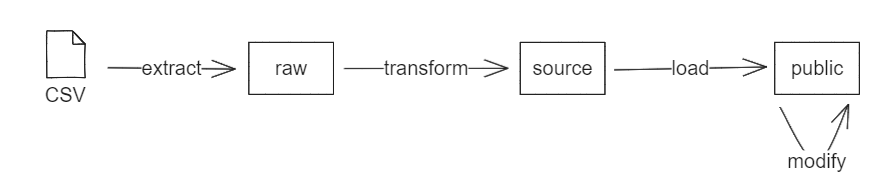

# Structure des scripts d'intégration

## Organisation

### Natures des tables d'intégration

La base Champollion comporte des tables permanentes qu'elles soient de natures statiques (tables contextuelles) ou dynamiques (tables mises à jour chaque mois). Pour plus de détails, voir le [cahier technique](../../database/guide_technique_bases_de_donnees.md) de la base Champollion. En complément de ces tables, des tables temporaires sont nécessaires afin d'intégrer de nouvelles données. On distingue quatre types de tables temporaires :

- les **tables raw** permettent l'import en base de données brutes à partir de fichiers csv ;
- les **tables source** sont créées à partir des tables *raw* et permettent le formattage des données brutes ;
- les **tables link** sont nécessaires afin d'enregistrer le mapping entre les id dans la base brute des lignes brutes et l'id en base Champollion de ligne mise à jour ou créée en conséquence ;
- les **tables map** permettent le recensement des lignes à fusionner lors des opérations de prise en compte des changements de clefs identifiantes.

Dans la base de données, les tables *raw* font l'objet d'un schéma **raw** et les tables *source*, *link* et *map* sont regroupées dans un schéma **source**.

Ainsi, l'import de données suit le schéma suivant : 



[Lien éditable](https://excalidraw.com/#json=6bUVDQbLfSIEkWDwk3_5p,bwHisIrHAzz_nVuuUvKS9Q)

### Tables de log

Les opérations effectuées sur la base sont logguées à trois niveaux :

- dans la table `log.integrations_logs`, chaque intégration fait l'objet de deux lignes (une `BEGIN` et une `END`) enregistrant l'heure de début et de fin de l'intégration ainsi que le mois de déclaration concerné ;
- dans la table `log.scripts_logs`, chaque exécution de script SQL est recensée dans deux lignes (une `BEGIN` et une `END`) enregistrant l'heure et le nombre de lignes de la table principalement impactée au début et à la fin de l'exécution du script ; 
- dans la table `log.processes_logs`, sur chaque table, chaque procédure (fonctions `INSERT`, `UPDATE`, `DELETE`, `TRUNCATE`) est répertoriée par deux lignes (une `BEGIN` et une `END`) contenant l'heure et le nombre de lignes de la table au début et à la fin de la procédure.

La correspondance entre chaque script SQL et sa table principale est issue de la table statique `sys.metadata_scripts`, elle-même alimentée à partir du fichier [`dsn_processing/resources/metadata_scripts.csv`](https://gitlab.intranet.social.gouv.fr/champollion/dsn_processing/blob/dev/resources/metadata_scripts.csv).

### Classification des scripts

#### Axes de classification

Les scripts SQL composant l'ETLM (Extract-Transform-Load-Modify) de la base Champollion peuvent être classifiés selon trois dimensions :
-	la famille (aussi appelée dag) qui correspond à la procédure dans lequel il s'inscrit ;
-	le type qui correspond à l’opération effectuée ;
-	et la nature qui correspond à la tâche effectuée.

On distingue trois familles principales (dags) de scripts : 
-	les **scripts `init_database`** relatifs à l'initialisation de la base ;
-   les **scripts `update_database`** relatifs à la mise à jour périodique (annuelle ou sur demande) des informations statiques de la base ;
-	les **scripts `monthly_integration`** qui encodent toutes les opérations nécessaires pour importer mensuellement des données.

Chaque famille de script fait l'objet d'un dossier spécifique dans `dsn_processing/core/sql/`.

De plus, il existe deux types de scripts :
-	les **processing (P) scripts** : ils encodent une action effectuée sur la base sans import de données.
-	les **importing (I) scripts** : ils encodent un import de données dans la base et doivent donc être appelés avec un csv.

Pour finir, la plupart des scripts peuvent être classifiés selon la nomenclature Extract-Transform-Load-Modify. On distingue :
-   les **create (C) scripts** : ils crééent les schémas, tables, fonctions de la base ;
-	les **extract (E) scripts** : ils importent les données brutes dans les tables *raw* ;
-	les **transform (T) scripts** : ils traitent les données brutes des tables *raw* et les importent dans les tables *source* ;
-	les **load (L) scripts** : ils importent les données des tables *source* vers les tables permanentes de la base ;
-	les **modify (M) scripts** : ils modifient les données des tables permanentes de la base.

#### Liste

|  Dag  |  Type |  Nature |  Nom du script  |  Rang d'exécution au sein de sa famille |  Fonction  |
|---|---|---|---|---|---|
|  `init_database`  | P  | C | `create_permanent_tables` | 10 | Création de l'ensemble des schémas de la base et des tables permanentes. |
|  `init_database`  | P | C | `create_integration_tables` | 20 | Création des tables nécessaire pour l'intégration (raw, source, link, map). |
|  `init_database`  | P | C | `create_trigger_logs` | 30 | Création des trigger functions de logging. |
|  `init_database`  | P | C | `create_dag_status_functions` | 40 | Création des fonctions internes pour gestion du statut de la base. |
|  `update_database`  | P | EL | `extract_and_load_metadata` | 10 | Peuplement de la table `sys.metadata_scripts` qui recense les correspondances entre scripts, tables et dags. |
|  `update_database`  | I | EL | `update_naf` | 20 | Insertion des données manquantes dans la table statique qui recense les codes NAF. |
|  `update_database`  | I | EL | `update_conventions_collectives` | 30 | Insertion des données manquantes dans la table statique qui recense les codes de convention collective.  |
|  `update_database`  | I | EL | `update_categories_juridiques_insee` | 40 | Insertion des données manquantes dans la table statique qui recense les codes de catégories juridiques de l’INSEE. |
|  `update_database`  | I | EL | `update_motifs_recours`  | 50 | Insertion des données manquantes dans la table statique qui recense les codes relatifs aux motifs de recours.  |
|  `update_database`  | I | EL | `update_natures_contrats`  | 60 | Insertion des données manquantes dans la table statique qui recense les codes relatifs aux natures de contrat. |
|  `update_database`  | P | L | `update_calendar` | 70 | Insertion des données calendaires manquantes dans la table calendrier (via une fonction Postgres). |
|  `update_database`  | I | EL | `update_holidays` | 80 | Mise à jour du champ `public_holiday` de la table calendrier. |
|  `update_database`  | I | EL | `update_zonage` | 90 | Mise à jour de la table statique qui recense les appariemments (SIRET, unité de contrôle). |
|  `monthly_integration` | P | L | `integration_log_begin` | 10 | Déclaration du début de l'intégration dans la table de logs des intégrations. |
|  `monthly_integration` | P | M | `remove_ctt`  | 20 | Suppression de toutes les lignes, créées lors d’un précédent allocate_ctt, qui correspondent aux contrats d’intérim redistribués des entreprises de travail temporaires (ETT) vers les entreprises utilisatrices (ETU).  |
|  `monthly_integration` | P | M | `remove_stt`  | 30 | Suppression de toutes les lignes, créées lors d’un précédent allocate_stt, qui correspondent aux salariés intérimaires redistribués des ETT vers les ETU. |
|  `monthly_integration` | P | M | `reindex_tables` | 40 | Ré-indexation des tables salariés et contrats. |
|  `monthly_integration` | P | M | `set_dernier_mois_de_declaration_integre` | 50 | Renseignement du mois de déclaration qui est intégré dans la table public.chargement_donnees. |
|  `monthly_integration` | I | E | `extract_etablissements` | 60 | Insertion des données brutes dans la table raw. |
|  `monthly_integration` | P | T | `transform_entreprises` | 70 | Peuplement de la table source. |
|  `monthly_integration` | P | L | `load_entreprises`  | 80 | Import des données mensuelles de la table source dans la table permanente.  |
|  `monthly_integration` | P | T | `transform_etablissements`  | 90 | Peuplement de la table source. |
|  `monthly_integration` | P | L | `load_etablissements` | 100 | Import des données mensuelles de la table source dans la table permanente.  |
|  `monthly_integration` | P | M | `modify_ouverture_etablissements` | 110 | Inférence du statut ouvert / fermé d'un établissement sur l'ancienneté de sa dernière déclaration. |
|  `monthly_integration` | I | E | `extract_salaries` | 120 | Insertion des données brutes dans la table raw. |
|  `monthly_integration` | P | T | `transform_salaries`  | 130 | Peuplement de la table source. |
|  `monthly_integration` | P | L | `load_salaries` | 140 | Import des données mensuelles de la table source dans la table permanente.  |
|  `monthly_integration` | I | E | `extract_contrats` | 150 | Insertion des données brutes dans la table raw. |
|  `monthly_integration` | P | L | `load_postes` | 160 | Import des nouveaux libellés de poste. |
|  `monthly_integration` | P | T | `transform_contrats`  | 170 | Peuplement de la table source. |
|  `monthly_integration` | P | L | `load_contrats` | 180 | Import des données mensuelles de la table source dans la table permanente.  |
|  `monthly_integration` | I | E | `extract_changements_salaries` | 190 | Insertion des données brutes dans la table raw. |
|  `monthly_integration` | P | T | `transform_changements_salaries` | 200 | Peuplement de la table source. |
|  `monthly_integration` | P | M | `modify_changements_salaries` | 210 | Modification des données des tables salariés et contrats au regard des changements relatifs aux salariés recensés. |
|  `monthly_integration` | I | E | `extract_changements_contrats` | 220 | Insertion des données brutes dans la table raw. |
|  `monthly_integration` | P | T | `transform_changements_contrats` | 230 | Peuplement de la table source. |
|  `monthly_integration` | P | M | `modify_changements_contrats` | 240 | Modification des données de la table contrats au regard des changements relatifs aux contrats recensés. |
|  `monthly_integration` | I | E | `extract_fins_contrats` | 250 | Insertion des données brutes dans la table raw. |
|  `monthly_integration` | P | T | `transform_fins_contrats` | 260 | Peuplement de la table source. |
|  `monthly_integration` | P | M | `modify_fins_contrats` | 270 |  Modification des valeurs de date de fin dans la table contrats. |
|  `monthly_integration` | P | M | `modify_debuts_contrats`  | 280 |  Modification des valeurs de date de début dans la table contrats. |
|  `monthly_integration` | I | E | `extract_versements` | 290 | Insertion des données brutes dans la table raw. |
|  `monthly_integration` | I | E | `extract_remunerations` | 300 | Insertion des données brutes dans la table raw. |
|  `monthly_integration` | I | E | `extract_activites` | 310 | Insertion des données brutes dans la table raw. |
|  `monthly_integration` | P | T | `transform_activites` | 320 | Peuplement de la table source. |
|  `monthly_integration` | P | L | `load_activites` | 330 | Import des données mensuelles de la table source dans la table permanente.  |
|  `monthly_integration` | P | M | `remove_old_data` | 340 | Suppression des données ayant dépassée la durée maximale de conservation. |
|  `monthly_integration` | P | M | `allocate_stt`  | 350 | Redistribution des salariés de travail temporaire des ETT vers les ETU.  |
|  `monthly_integration` | P | M | `allocate_ctt`  | 360 | Redistribution des contrats de travail temporaire des ETT vers les ETU.  |
|  `monthly_integration` | P | | `monthly_sanity_checks` | 370 | Vérification de tests de cohérence sur la base. |
|  `monthly_integration` | P | | `clean_database` | 380 | Suppression des données des tables des schémas `raw` et `source`. |
|  `monthly_integration` | P | L | `integration_log_end` | 390 | Déclaration de la fin de l'intégration dans la table de logs des intégrations. |

## Génération

### Fichier python de génération des scripts SQL

Les scripts SQL sont générés via Python car cela permet l'utilisation de fonctions génériques. 

**Dès lors, les scripts SQL ne doivent être générés et modifiés que via le fichier `dsn_processing/core/sql/generate_sql.py`.**

#### Utilisation du fichier de génération

Le [fichier `dsn_processing/core/sql/generate_sql.py`](https://gitlab.intranet.social.gouv.fr/champollion/dsn_processing/blob/dev/core/sql/generate_sql.py) s'utilise de la façon suivante.

```bash
usage: generate_sql.py [-h] [-f FILE] [-d DAG] [-v]
Script to generate a SQL task script.
options:
  -h, --help            show this help message and exit
  -f FILE, --file FILE  SQL file name to generate (without extension), generate all files if None.
  -d DAG, --dag DAG     Dag ID to store the SQL script, if not specified set the default value for each task.
  -v, --verbose         print logs
```

Si on veut re-générer l'ensemble des scripts, on exécutera : 

```bash
python core/sql/generate_sql.py
```

#### Modification et ajout de script

Au sein du fichier `dsn_processing/core/sql/generate_sql.py`, le code qui permet l'écriture d'un script en particulier est sous la forme :

```python
if generate_all or args.file == <script_name>:
    query = ...
    write_sql_file(<default_dag>, <script_name>, query, to_log=<True/False>)
```

Le paramètre `to_log` de la fonction `write_sql_file` permet, s'il est renseigné à `True`, d'ajouter les appels aux fonctions de log au début et à la fin du script.

Les ... font référence soit à une chaîne de caractère encodant une requête SQL soit à une fonction Python qui renvoie une chaîne de caractère encodant une requête SQL. Lorsqu'il s'agit d'une fonction, sauf exception, cette dernière doit être stockée dans le fichier `dsn_processing/core/sql/utils.py`. Voir les deux exemples ci-dessous.

*Génération d'un script via une chaîne de caractère.*

```python
if generate_all or args.file == "create_test":
    query = """CREATE TABLE test (id INTEGER PRIMARY KEY, field TEXT);"""
    write_sql_file("create_dag", "create_test", query, to_log=True)
```

*Génération d'un script par appel d'une fonction Python.*
```python
if generate_all or args.file == "create_test":
    create_table('test')
    write_sql_file("create_dag", "create_test", query, to_log=True)

# dans le fichier dsn_processing/core/sql/utils.py 
def create_table(name):
    return  f"""CREATE TABLE {name} (id INTEGER PRIMARY KEY, field TEXT);"""
```

Une fois les modifications du fichier `dsn_processing/core/sql/generate_sql.py` effectuées, il faut re-générer l'ensemble des scripts impactés ou tout re-générer.

### Standards SQL - linter

#### Intérêt d'un linter

On utilise un linter SQL pour assurer la lisibilité et l'homogénéité des scripts. Cela permet aussi de détecter en amont les erreurs les plus évidentes. *Pour plus d'informations sur les linter en général, voir ce [lien](https://en.wikipedia.org/wiki/Lint_(software)).*

On utilise le linter [sqlfluff](https://github.com/sqlfluff/sqlfluff). Il peut être installé avec pip. Un fichier de configurations `.sqlfluff` est présent à la racine du dossier, il définit les particularités du linter pour le projet Champollion.

#### Comment *linter* un fichier <name>.sql ?

1. S'assurer que sqlfluff est bien installé avec `sqlfluff -h`.
2. Lancez la ligne de commande suivante :
```bash
sqlfluff lint <name>.sql
```
3. Si des erreurs s'affichent :
    * Soit le fichier est généré par Python et on corrige les erreurs dans le fichier Python directement. Puis on regénère le fichier SQL.
    * Soit le fichier SQL n'est pas généré par un autre fichier et on corrige directement le fichier SQL.
4. On relance et on corrige les erreurs tant que :
```bash
sqlfluff lint <name>.sql
```
n'affiche pas
```bash
All Finished 📜 🎉! 
```

Si on souhaite faire passer les tests à l'ensemble des scripts SQL, on éxécutera : 
```bash
sqlfluff lint core/sql/*/*.sql
```